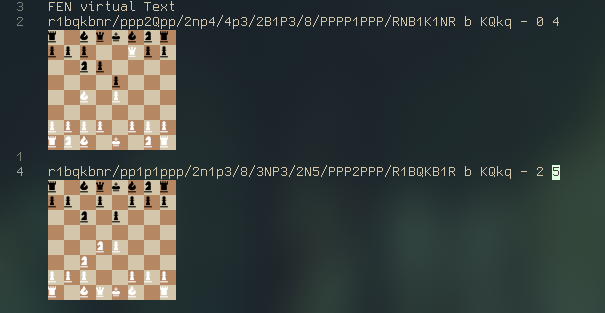

# chess-viewer.nvim
A chess viewer plugin for neovim

This Project is currently work in progress.

## FEN

## PGN
- TODO

## Commands
- `ChessViewer` shows matching FEN strings in virtual text.

## Goals:

- [x] show chess board with FEN notation
- [ ] show chess board with PGN notation (cursor hover determins position) 
